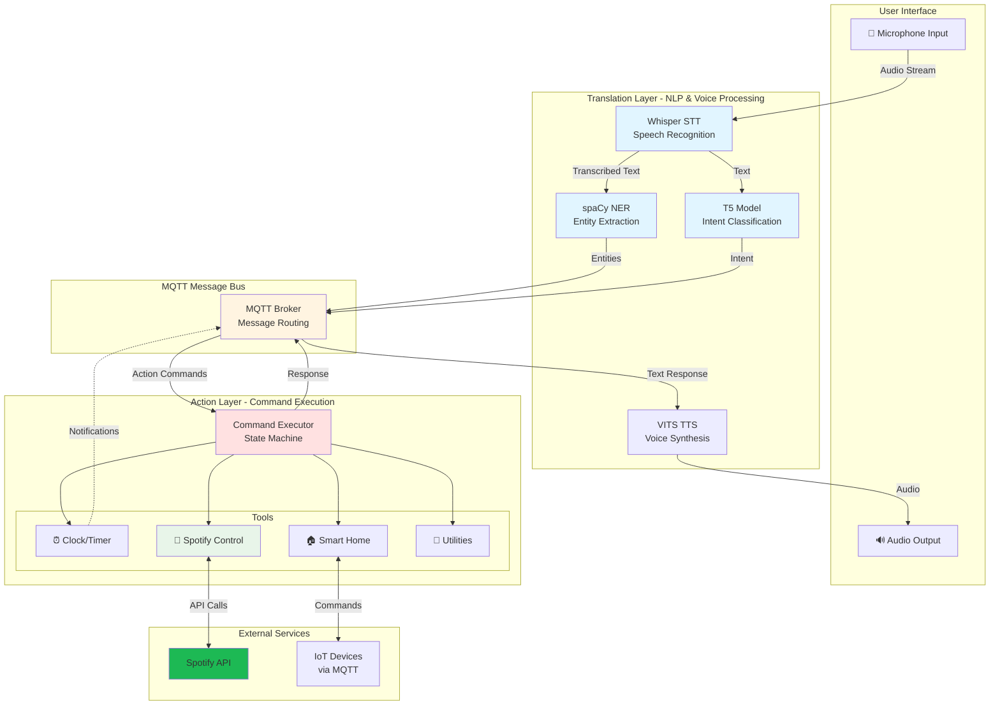
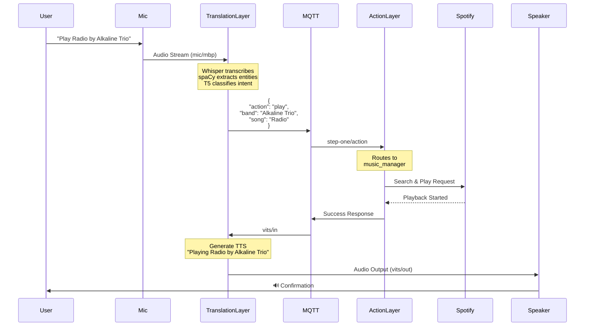

# Eddie - Privacy-First Local Voice Assistant

<p align="center">
  <em>Your personal AI assistant that respects your privacy</em>
</p>

Eddie is a privacy-first, locally-hosted voice assistant designed as an open-source alternative to cloud-based assistants like Alexa, Google Assistant, and Siri. Built with a focus on keeping your data on your own hardware, Eddie processes all voice commands locally using state-of-the-art AI models.

## ✨ Features

### 🎤 Voice Control
- Local speech recognition using OpenAI Whisper
- Natural language understanding with T5 language models
- Custom NLP pipeline for intent classification and entity extraction

### 🏠 Smart Home Integration
- MQTT-based home automation control
- Extensible architecture for custom IoT integrations
- Real-time device state management

### 🎵 Music Control
- Spotify integration with fuzzy search
- Play songs, albums, or artists by voice
- Playback controls (play, pause, skip)

### ⏰ Utility Functions
- World clock with timezone support
- Customizable timers with audio notifications
- Dice rolling and coin flipping
- Weather information

### 🔒 Privacy-First Design
- All voice processing happens locally on your hardware
- No cloud dependencies for core functionality
- Your conversations never leave your network
- Full control over your data

## 🏗️ Architecture

Eddie consists of two main layers:

### Translation Layer
Handles voice input and natural language processing:
- Audio capture and transcription (Whisper)
- Intent classification (T5)
- Entity extraction (spaCy)
- MQTT message routing

### Action Layer
Executes commands and manages integrations:
- Tool execution framework
- Music manager (Spotify)
- Timer manager
- Smart home controls
- State machine for workflow management

### System Architecture



### Message Flow Example

Here's how Eddie processes a voice command to play music:



## 🚀 Getting Started

### Prerequisites

- Python 3.8+
- MQTT broker (e.g., Mosquitto)
- CUDA-capable GPU recommended for optimal performance
- Spotify Developer Account (for music features)

### Installation

1. Clone the repository:
```bash
git clone https://github.com/yourusername/eddie.git
cd eddie
```

2. Install dependencies:
```bash
pip install -r requirements.txt
```

3. Download required models:
```bash
# Download spaCy model
python -m spacy download en_core_web_lg

# Whisper and T5 models will be downloaded automatically on first run
# or you can pre-download them to specific locations
```

4. Configure environment variables:
```bash
cp .env.example .env
# Edit .env with your configuration
```

### Configuration

Edit the `.env` file with your settings:

```bash
# MQTT Configuration
MQTT_HOST=192.168.1.57
MQTT_PORT=1883
MQTT_USERNAME=your_username
MQTT_PASSWORD=your_password

# Spotify Configuration
SPOTIFY_CLIENT_ID=your_client_id
SPOTIFY_CLIENT_SECRET=your_client_secret
SPOTIFY_REDIRECT_URI=http://localhost:8000

# Model Paths (customize based on your setup)
WHISPER_MODEL_PATH=/path/to/whisper/small.en.pt
T5_MODEL_PATH=/path/to/t5/model
T5_TOKENIZER_PATH=/path/to/t5/tokenizer
```

### Running Eddie

Start the Translation Layer (voice processing):
```bash
python translate.py
```

Start the Action Layer (command execution):
```bash
python action.py
```

For production deployment, you can use systemd services or supervisord to manage both processes.

## 📁 Project Structure

```
eddie/
├── TranslationLayer/          # Voice processing and NLP
│   ├── translator.py          # Main translation engine
│   ├── agent.py               # NLP agent
│   ├── prompts.py             # LLM prompts
│   └── vits.py                # Voice synthesis
├── ActionLayer/               # Command execution
│   ├── doer.py                # Main action executor
│   ├── tools.py               # Tool implementations
│   ├── clock.py               # Time utilities
│   └── timezones.py           # Timezone data
├── config.py                  # Configuration management
├── tools.py                   # Shared utilities
├── requirements.txt           # Python dependencies
└── README.md                  # This file
```

## 🎯 Usage Examples

### Voice Commands

**Time Queries:**
- "What time is it?"
- "What's the time in Tokyo?"

**Music Control:**
- "Play Radio by Alkaline Trio"
- "Play Taylor Swift"
- "Pause music"
- "Skip this song"

**Timers:**
- "Set a timer for 5 minutes"
- "How much time is left?"
- "Cancel the timer"

**Utilities:**
- "Roll a dice"
- "Flip a coin"
- "What's the weather?"

## 🔧 Customization

### Adding New Tools

To add new functionality, create a tool in `ActionLayer/tools.py`:

```python
def my_custom_tool(keywords):
    # Your implementation here
    return "Response to user"

# Register in doer.py
self.tools = {
    'my_category': my_custom_tool,
    # ... other tools
}
```

### Training Custom NER Models

Eddie uses custom spaCy NER models for entity extraction. You can train your own models for domain-specific entities (e.g., song names, artists).

## 🛠️ MQTT Topics

Eddie communicates via MQTT. Key topics:

- `mic/mbp` - Audio input
- `mic/voice` - Voice probability
- `step-one/action` - Action commands
- `vits/in` - Text-to-speech input
- `vits/out` - Audio output

## 🤝 Contributing

Contributions are welcome! Eddie is designed to be extensible and community-driven.

1. Fork the repository
2. Create a feature branch (`git checkout -b feature/amazing-feature`)
3. Commit your changes (`git commit -m 'Add amazing feature'`)
4. Push to the branch (`git push origin feature/amazing-feature`)
5. Open a Pull Request

## 📝 License

This project is open source and available under the MIT License.

## 🙏 Acknowledgments

- OpenAI Whisper for speech recognition
- Hugging Face Transformers for NLP
- spaCy for entity extraction
- The open-source community for inspiration

## 🗺️ Roadmap

- [ ] Web interface for configuration
- [ ] Plugin system for easy extensions
- [ ] Multi-language support
- [ ] Voice synthesis improvements
- [ ] Docker containerization
- [ ] Raspberry Pi optimization
- [ ] Home Assistant integration
- [ ] Wake word detection

## 📧 Contact

For questions, suggestions, or issues, please open an issue on GitHub.

---

**Note:** Eddie requires local AI models and computing resources. A CUDA-capable GPU is recommended for optimal performance, though CPU-only operation is possible with reduced speed.
